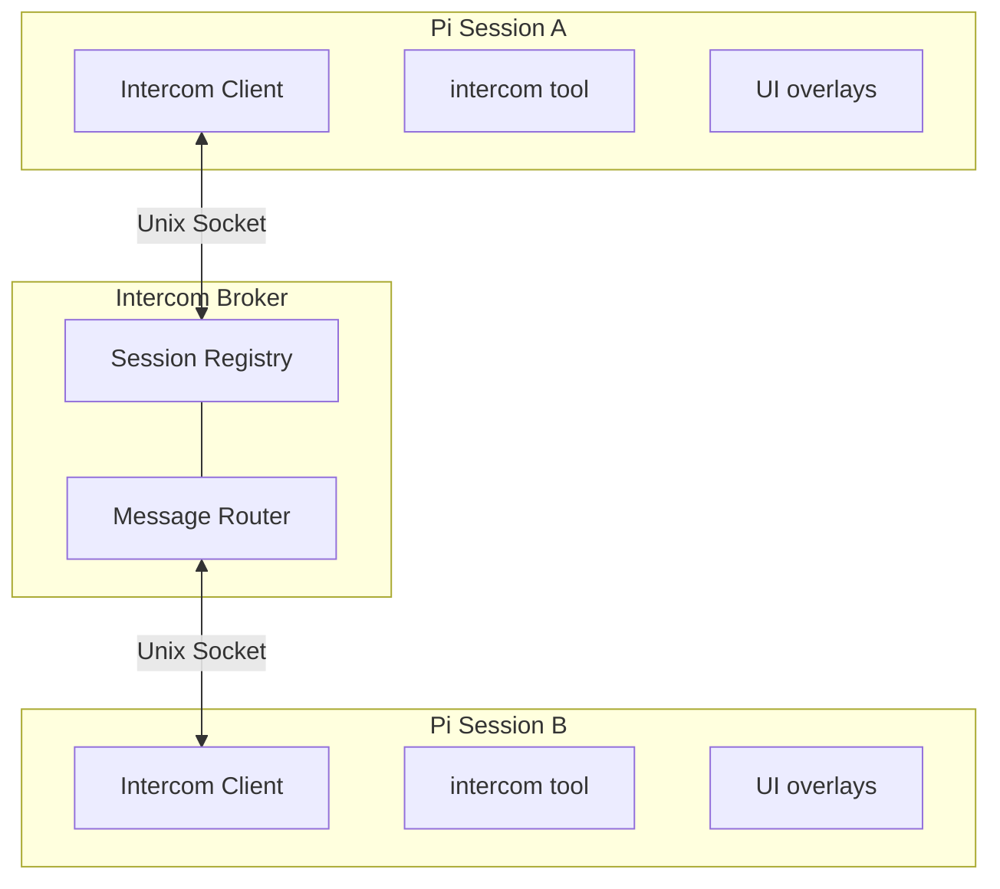

<p>
  
</p>

# Pi Intercom

Direct 1:1 messaging between pi sessions on the same machine. Send context, findings, or requests from one session to another — whether you're driving the conversation or letting agents coordinate.

```typescript
intercom({ action: "send", to: "research", message: "Found the bug in auth.ts:142" })
```

## Why

Sometimes you're running multiple pi sessions — one researching, one executing, one reviewing. Pi-intercom lets you:

- **User-driven orchestration** — Send context or findings from your research session to your execution session
- **Agent collaboration** — An agent can reach out to another session when it needs help or wants to share results
- **Session awareness** — See what other pi sessions are running and their current status

Unlike pi-messenger (a shared chat room for multi-agent swarms), pi-intercom is for targeted 1:1 communication where you pick the recipient.

## Install

```bash
pi install npm:pi-intercom
```

Then restart Pi. The extension auto-connects to the broker on startup.

## Quick Start

### From the Keyboard

Press **Alt+M** or type `/intercom` to open the session list overlay:

1. **Select a session** — Use arrow keys to pick a target session
2. **Compose message** — Write your message in the compose overlay
3. **Send** — Press Enter to send, Escape to cancel

### From the Agent

The agent can list sessions and send messages using the `intercom` tool:

```typescript
// List active sessions
intercom({ action: "list" })
// → • research — ~/projects/api (claude-sonnet-4) [researching]
// → • executor — ~/projects/api (claude-sonnet-4) [idle]

// Send a message
intercom({ action: "send", to: "research", message: "Check if UserService.validate() handles null" })
// → Message sent to research

// Check connection status
intercom({ action: "status" })
// → Connected: Yes, Session ID: abc123, Active sessions: 3
```

### Receiving Messages

When a message arrives, it appears inline in your chat with the sender's info and a reply hint:

```
**📨 From research** (~/projects/api) — reply: intercom({ action: "send", to: "550e8400-e29b-41d4-a716-446655440000", replyTo: "c1f7...", message: "..." })

Found the issue — UserService.validate() doesn't check for null input.
See auth.ts:142-156.
```

The reply hint (enabled by default) shows the exact `intercom()` call to respond, including the sender's session ID as `to` and the original message ID as `replyTo`, so `ask` can match the answer precisely. For `ask` to resolve reliably, replies should include that `replyTo` value. The message triggers a new turn, so the agent can respond or act on it immediately. If the message includes attachments, their content is also included in the agent-visible message body.

## Workflow: Planner-Worker Coordination

The most natural use of pi-intercom is splitting a task between two sessions — one holds the big picture, the other does the hands-on work. When the worker hits an ambiguity ("should I optimize for readability or performance here?"), they ask without losing context.

### Setup

Open two terminals and start pi in each. Name them so they can find each other:

```
# Terminal 1                    # Terminal 2
/name planner                   /name worker
```

Verify they see each other from either session:

```typescript
intercom({ action: "list" })
// → • worker — ~/projects/api (claude-sonnet-4) [idle]
```

### The Conversation

Here's how a typical exchange looks. The planner delegates with `send` (fire-and-forget). The worker uses `ask` for anything that needs a response — questions, discoveries, completion reports. `ask` sends the message and blocks until the planner replies, so the worker gets the answer as a tool result and continues in the same turn.

**Planner sends a task:**
```typescript
intercom({
  action: "send",
  to: "worker",
  message: "Task-3: Add retry logic to API client. Key files: src/api/client.ts, src/api/types.ts. Ask if anything's unclear."
})
```

**Worker hits an ambiguity — asks and waits:**
```typescript
intercom({
  action: "ask",
  to: "planner",
  message: "Should retry apply to all endpoints or just idempotent ones? Also, max retry count and backoff strategy?"
})
// → Reply from planner: Only GET/PUT/DELETE — never POST. Max 3 retries, exponential backoff starting at 100ms.
// Worker continues implementing with the answer, same turn, full context.
```

**Worker finds something unexpected — escalates and waits:**
```typescript
intercom({
  action: "ask",
  to: "planner",
  message: "Found: fetchWithTimeout swallows network errors. Fixing this changes the error shape. OK to proceed?"
})
// → Reply from planner: Yes, surface the error types. The current behavior is a bug.
```

**Worker reports completion:**
```typescript
intercom({
  action: "ask",
  to: "planner",
  message: "Task-3 done. Added RetryPolicy type, applied to GET/PUT/DELETE, surfaced NetworkError, 4 tests passing."
})
// → Reply from planner: Looks good. Move on to task-4.
```

### Communication Patterns

| Pattern | Action | Why |
|---------|--------|-----|
| **Task Delegation** | Planner uses `send` | Fire-and-forget. Planner doesn't need to wait for an ack. |
| **Clarification Request** | Worker uses `ask` | Worker needs the answer to proceed. Blocks until reply. |
| **Discovery Escalation** | Worker uses `ask` | Worker needs approval before changing course. |
| **Completion Report** | Worker uses `ask` | Planner might have follow-up instructions or the next task. |

### Reply Hints

When `replyHint` is enabled (the default), incoming messages include the exact `intercom()` call to respond:

```
**📨 From planner** (~/projects/api) — reply: intercom({ action: "send", to: "550e8400-e29b-41d4-a716-446655440000", replyTo: "c1f7...", message: "..." })

Only GET/PUT/DELETE — never POST. Max 3 retries with exponential backoff starting at 100ms.
```

This matters because the agent receiving the message doesn't need to construct the reply call from scratch — the hint is right there. Combined with `triggerTurn` (which wakes the recipient agent on delivery), it enables real back-and-forth conversation without any complex protocol machinery.

### `send` vs `ask`

`send` is fire-and-forget — the tool returns immediately after delivery. By default it shows a confirmation dialog (disable with `autoSend: true` in config).

`ask` sends the message and blocks until the recipient responds (10-minute timeout). The reply comes back as the tool result, so the agent continues in the same turn with full context. No confirmation dialog — if you're asking and waiting, the intent is clear.

The planner typically uses `send` (user reviews outgoing messages). The worker uses `ask` for everything (no confirmation needed, gets answers inline). This means the worker can operate fully autonomously without needing `autoSend: true`.

## Tool Reference

### intercom

| Parameter | Type | Description |
|-----------|------|-------------|
| `action` | string | `"list"`, `"send"`, `"ask"`, or `"status"` |
| `to` | string | Target session name or ID (for send/ask) |
| `message` | string | Message text (for send/ask) |
| `attachments` | array | Optional file/snippet attachments |
| `replyTo` | string | Optional message ID for threading or replying to an `ask` |

### Actions

**`list`** — Returns all active sessions (excluding self) with name, working directory, model, and status.

**`send`** — Sends a message to the specified session. By default, shows a confirmation dialog (disable with `autoSend: true` in config). Returns delivery confirmation.

**`ask`** — Sends a message and waits for the recipient to reply (10-minute timeout). The reply is returned as the tool result. No confirmation dialog. Use this when the agent needs the answer to continue working.

**`status`** — Shows connection status, session ID, and count of active sessions.

## Keyboard Shortcuts

| Key | Action |
|-----|--------|
| Alt+M | Open session list overlay |
| ↑/↓ | Navigate session list |
| Enter | Select session / Send message |
| Escape | Cancel / Close overlay |

## Config

Create `~/.pi/agent/intercom/config.json`:

```json
{
  "autoSend": false,
  "enabled": true,
  "replyHint": true,
  "status": "researching"
}
```

| Setting | Default | Description |
|---------|---------|-------------|
| `autoSend` | false | Skip confirmation dialog when agent sends messages |
| `enabled` | true | Enable/disable intercom entirely |
| `replyHint` | true | Include reply instruction in incoming messages |
| `status` | — | Custom status shown to other sessions |

## How It Works



The broker is a standalone TypeScript process that manages session registration and message routing. It auto-spawns when the first session needs it and exits after 5 seconds when the last session disconnects.

Messages use length-prefixed JSON over Unix sockets (4-byte length + JSON payload) to handle fragmentation properly.

Runtime files live at `~/.pi/agent/intercom/`:
- `broker.sock` — Unix socket for communication
- `broker.pid` — Broker process ID
- `config.json` — User configuration

## Design Decisions

**Unix sockets over TCP.** Same-machine only by design. Unix sockets are faster, need no port allocation, and get filesystem-level access control for free.

**Auto-spawn with file lock.** The broker spawns on first connection and exits after 5 seconds idle. No daemon management. A spawn lock file (with PID and timestamp for staleness detection) prevents multiple clients from spawning duplicate brokers when sessions start simultaneously.

**`ask` as client-side blocking, not protocol-level.** The `ask` action blocks the tool call until a reply arrives, but this is purely client-side behavior — the broker still routes plain messages. No correlation IDs, no request/response message types, no protocol changes. The client registers an interceptor on the message handler, catches the reply before it triggers a new turn, and returns it as the tool result. Reply hints in `send` messages complement this by showing the recipient exactly how to respond.

## pi-intercom vs pi-messenger

| Aspect | pi-intercom | pi-messenger |
|--------|-------------|--------------|
| **Model** | Direct 1:1 messaging | Shared chat room |
| **Primary use** | User orchestrating sessions | Autonomous agent coordination |
| **Discovery** | Broker-based (real-time) | File-based registry |
| **Messages** | Private, session-to-session | Broadcast to all agents |
| **Persistence** | In sender & receiver history | Shared coordination files |

Use pi-messenger for multi-agent swarms working on a shared task. Use pi-intercom when you want to manually coordinate your own sessions or have one agent reach out to another specific session.

## File Structure

```
~/.pi/agent/extensions/pi-intercom/
├── package.json
├── index.ts           # Extension entry point (497 lines)
├── types.ts           # SessionInfo, Message, protocol types
├── config.ts          # Config loading
├── broker/
│   ├── broker.ts      # Broker process (228 lines)
│   ├── client.ts      # IntercomClient class (345 lines)
│   ├── framing.ts     # Length-prefixed JSON protocol
│   └── spawn.ts       # Auto-spawn logic with lock file
└── ui/
    ├── session-list.ts    # Session selection overlay
    ├── compose.ts         # Message composition overlay
    └── inline-message.ts  # Received message display
```

## Limitations

- **Same machine only** — Uses Unix sockets, no network support
- **No message history** — Messages appear inline but aren't persisted to a log file
- **No attachments UI** — File/snippet attachments are supported in the protocol but not exposed in the compose overlay
- **Broker must be running** — Auto-spawns, but if it crashes, sessions need to reconnect (happens on next action)
